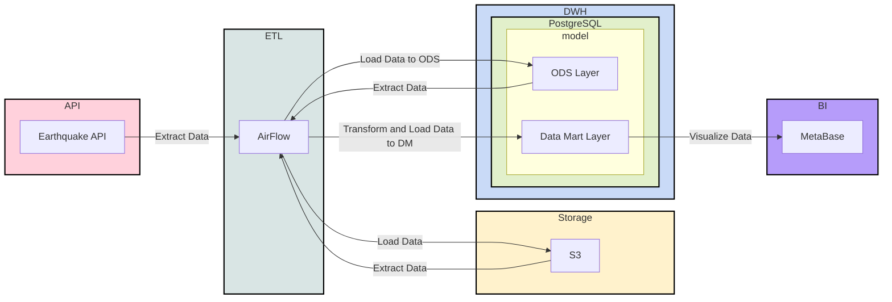
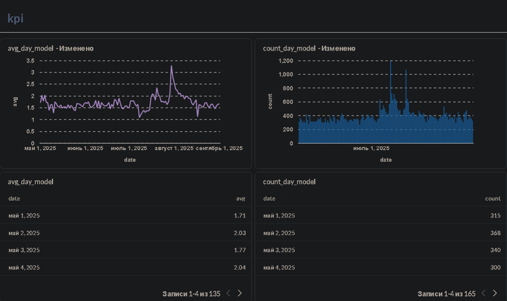

# Data Lakehouse ETL

This project implements a complete End-to-End Data Engineering cycle using a modern technology stack. The pipeline collects earthquake data, stores raw data in Object Storage, transfers it to DWH, and builds analytical data marts.

Project goal: demonstrating skills with Airflow, MinIO (S3), PostgreSQL, and Docker combined with Python.

## 🛠 Technology Stack

| Category | Technology | Description |
| :--- | :--- | :--- |
| **Orchestration** | **Apache Airflow** (2.10.x) | Task scheduling and dependency management |
| **Storage (Raw)** | **MinIO** (S3 Compatible) | Raw JSON file storage (Data Lake) |
| **DWH** | **PostgreSQL** | Processed data and data mart storage |
| **BI / Viz** | **Metabase** | Data visualization |
| **Infra** | **Docker Compose** | Local infrastructure deployment |
| **Language** | **Python 3.12** | ETL scripts and DAGs |

## 🔄 Data Architecture

1.  **Ingest:** Data extraction from [USGS Earthquake API](https://earthquake.usgs.gov/fdsnws/event/1/#methods).
2.  **Raw Layer:** Saving JSON responses to MinIO (S3 bucket) to ensure data historicity (Bronze layer).
3.  **ODS Layer:** JSON parsing and loading structured data into PostgreSQL (Silver layer).
4.  **Data Marts:** SQL transformations for building business data marts (Gold layer):
    * `fct_count_day_earthquake` — event count by day.
    * `fct_avg_day_earthquake` — average magnitude by day.


## 📊 Data Pipeline Architecture




## 📂 Repository Structure

```text
.
├── dags/                           # Airflow DAGs and ETL scripts
│   ├── raw_from_api_to_s3.py       # Extract: API -> S3
│   ├── raw_from_s3_to_pg.py        # Load: S3 -> Postgres
│   ├── fct_count_day_earthquake.py # Transform: Data Mart (Counts)
│   └── fct_avg_day_earthquake.py   # Transform: Data Mart (Avg Magnitude)
├── metabase/                       # Metabase configuration (Dockerfile)
├── docker-compose.yaml             # Infrastructure definition
├── requirements.txt                # Python dependencies
└── README.md                       # Project documentation

```

## 🚀 Quick Start

### 1. Environment Setup

For local development and linting (optional):

```PowerShell
py -m venv venv && \
venv\Scripts\activate.ps1 && \
pip install --upgrade pip && \
pip install -r requirements.txt

```

### 2. Infrastructure Deployment

Deploy services in Docker:

```powershell
docker compose up -d

```

### 3. Service Access

After successful startup (`docker ps`), services are available at the following addresses:

| Service | URL | Login (default) | Password (default) |
| --- | --- | --- | --- |
| **Airflow UI** | `http://localhost:8080` | `airflow` | `airflow` |
| **MinIO Console** | `http://localhost:9001` | `minioadmin` | `minioadmin` |
| **Metabase** | `http://localhost:3000` | `foo` | `foofoo1` |
| **Postgres** | `localhost:5432` | `postgres` | `postgres` |

## ⚙️ Manual Execution (Dev Mode)

In addition to running via Airflow DAGs, scripts can be tested locally:

**1. Data extraction to S3:**

```bash
python dags/raw_from_api_to_s3.py

```

**2. Loading from S3 to Postgres:**

```bash
python dags/raw_from_s3_to_pg.py

```

## 🔗 Useful Links

* [USGS API Documentation](https://earthquake.usgs.gov/fdsnws/event/1/#methods) — API methods.
* [USGS Data Format](https://earthquake.usgs.gov/data/comcat/index.php) — data field descriptions.
* [Apache Airflow Docs](https://airflow.apache.org/docs/) — official documentation.

---

### Data Modeling & Design

Star schema, snowflake, or other patterns are not applied because there's no need for them. The data volume is small. The state cannot change, so we create an "_AS IS_" model.

### Data Storage & Operations

#### Storage

Cold, Warm Storage – S3
Hot Storage – PostgreSQL

#### Compute/Operations

DuckDB – Data Lake
PostgreSQL – DM layer

### Data Security

Security is configured at the user level in S3 and through the role model in PostgreSQL. In Airflow, security is set through roles.

LDAP can be used here.

### Reference & Master Data

In this case, the data in the S3 Data Lake is our "_golden_" source. We took it from the source "_as is_" and don't modify it, thus the probability of losing it in our pipeline is 0%. However, this doesn't mean that data modification is impossible/prohibited. It's allowed in other "_layers_", at the DWH level or in custom implementations.

### Data Warehousing & Business Intelligence

As mentioned above, our "_hot_" storage is in PostgreSQL.

For the BI system, we use Metabase.

General recommendations for this section:

1) Set a "_lifespan_" for data marts. Because today the business needs data mart `N`, but in a month they won't. To prevent it from running needlessly, regular "_cleanups_" should be conducted.
2) Define roles for reports and permitted zones. For example, C-level should see all reports. While courier-level shouldn't see data marts for stock options and company revenue.
3) Establish rules for creating data marts:
    1) One metric – one data mart
    2) One metric – one view/materialized view
    3) Wide data mart
    4) Single table containing all metrics with approximately this structure: date-day, metric type, value
4) Activity monitoring and load tracking
5) Automatic refresh. Eliminate "_manual_" work

### Metadata

Currently, there's no metadata, but it can be defined, for example, through column comments in DWH.

Here's an example of all column descriptions – [Field descriptions from API](https://earthquake.usgs.gov/data/comcat/index.php)

For the Data Lake level, there should be dedicated tools for metadata management.

You need to find a data catalog that's convenient for your team: OpenMetadata, DataHub, etc.

### Data Quality

Currently, there's no data quality implementation.

But the basics include:

1) Check if data "_arrived_" (ACID).
2) Monitor data delivery SLA
3) Identify important dashboards. Set up various alerts for them.
4) When possible, look at the "_source_". For example, if the source has 1000 rows, but we have 999 rows in Data Lake/DWH, we should know about it immediately, not a month later.
5) A process is needed to fix such errors
6) If a data mart is Very important, run your own tests before it goes to prod. Look at the delta between values, look at average values, etc. "_Quality_" criteria should be clarified with the business.

## Notes

SQL schemas:

```sql
CREATE SCHEMA ods;
CREATE SCHEMA dm;
CREATE SCHEMA stg;
```

DDL `ods.fct_earthquake`:
```sql
CREATE TABLE ods.fct_earthquake
(
	time varchar,
	latitude varchar,
	longitude varchar,
	depth varchar,
	mag varchar,
	mag_type varchar,
	nst varchar,
	gap varchar,
	dmin varchar,
	rms varchar,
	net varchar,
	id varchar,
	updated varchar,
	place varchar,
	type varchar,
	horizontal_error varchar,
	depth_error varchar,
	mag_error varchar,
	mag_nst varchar,
	status varchar,
	location_source varchar,
	mag_source varchar
)
```

DDL `dm.fct_count_day_earthquake`:

```sql
CREATE TABLE dm.fct_count_day_earthquake AS 
SELECT time::date AS date, count(*)
FROM ods.fct_earthquake
GROUP BY 1
```

DDL `dm.fct_avg_day_earthquake`:

```sql
CREATE TABLE dm.fct_avg_day_earthquake AS
SELECT time::date AS date, avg(mag::float)
FROM ods.fct_earthquake
GROUP BY 1 
```
---


## Result Dashboard (Metabase)

