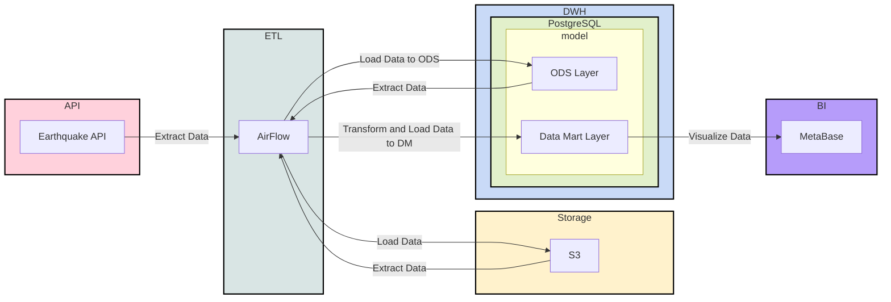

# Data Lahehouse ETL

Проект реализует полный цикл обработки данных (End-to-End Data Engineering) с использованием современного стека технологий. Пайплайн собирает данные о землетрясениях, сохраняет сырые данные в Object Storage, переносит их в DWH и строит аналитические витрины.

Цель проекта: демонстрация навыков работы с Airflow, MinIO (S3), PostgreSQL и Docker в связке с Python.

## 🛠 Технологический стек

| Категория | Технология | Описание |
| :--- | :--- | :--- |
| **Orchestration** | **Apache Airflow** (2.10.x) | Управление расписанием и зависимостями задач |
| **Storage (Raw)** | **MinIO** (S3 Compatible) | Хранение сырых JSON-файлов (Data Lake) |
| **DWH** | **PostgreSQL** | Хранилище обработанных данных и витрин |
| **BI / Viz** | **Metabase** | Визуализация данных |
| **Infra** | **Docker Compose** | Развертывание локальной инфраструктуры |
| **Language** | **Python 3.12** | Скрипты ETL и DAGs |

## 🔄 Архитектура данных

1.  **Ingest:** Извлечение данных из [USGS Earthquake API](https://earthquake.usgs.gov/fdsnws/event/1/#methods).
2.  **Raw Layer:** Сохранение JSON-ответов в MinIO (S3 bucket) для обеспечения историчности (Bronze layer).
3.  **ODS Layer:** Парсинг JSON и загрузка структурированных данных в PostgreSQL (Silver layer).
4.  **Data Marts:** SQL-трансформации для формирования бизнес-витрин (Gold layer):
    * `fct_count_day_earthquake` — количество событий по дням.
    * `fct_avg_day_earthquake` — средняя магнитуда по дням.


## 📊 Data Pipeline Architecture




## 📂 Структура репозитория

```text
.
├── dags/                           # Airflow DAGs и ETL скрипты
│   ├── raw_from_api_to_s3.py       # Extract: API -> S3
│   ├── raw_from_s3_to_pg.py        # Load: S3 -> Postgres
│   ├── fct_count_day_earthquake.py # Transform: Витрина (Counts)
│   └── fct_avg_day_earthquake.py   # Transform: Витрина (Avg Magnitude)
├── metabase/                       # Конфигурация Metabase (Dockerfile)
├── docker-compose.yaml             # Описание инфраструктуры
├── requirements.txt                # Python-зависимости
└── README.md                       # Документация проекта

```

## 🚀 Быстрый старт

### 1. Подготовка окружения

Для локальной разработки и линтинга (опционально):

```PowerShell
py -m venv venv && \
venv\Scripts\activate.ps1 && \
pip install --upgrade pip && \
pip install -r requirements.txt

```

### 2. Запуск инфраструктуры

Развертывание сервисов в Docker:

```powershell
docker compose up -d

```

### 3. Доступы к сервисам

После успешного запуска (`docker ps`), сервисы доступны по следующим адресам:

| Сервис | URL | Логин (default) | Пароль (default) |
| --- | --- | --- | --- |
| **Airflow UI** | `http://localhost:8080` | `airflow` | `airflow` |
| **MinIO Console** | `http://localhost:9001` | `minioadmin` | `minioadmin` |
| **Metabase** | `http://localhost:3000` | *(настройка при входе)* | *(настройка при входе)* |
| **Postgres** | `localhost:5432` | `airflow` | `airflow` |

## ⚙️ Ручной запуск (Dev Mode)

Помимо запуска через Airflow DAGs, скрипты можно протестировать локально:

**1. Экстракция данных в S3:**

```bash
python dags/raw_from_api_to_s3.py

```

**2. Загрузка из S3 в Postgres:**

```bash
python dags/raw_from_s3_to_pg.py

```

## 🔗 Полезные ссылки

* [USGS API Documentation](https://earthquake.usgs.gov/fdsnws/event/1/#methods) — методы API.
* [USGS Data Format](https://earthquake.usgs.gov/data/comcat/index.php) — описание полей данных.
* [Apache Airflow Docs](https://airflow.apache.org/docs/) — официальная документация.

---

### Data Modeling & Design

Не применяется звезда, снежинка или другое, потому что в этом нет необходимости. Данных немного. Состояние измениться не
может, поэтому создаём модель по типу "_AS IS_".

### Data Storage & Operations

#### Storage

Cold, Warm Storage – S3
Hot Storage – PostgreSQL

#### Compute/Operations

DuckDB – Data Lake
PostgreSQL – DM layer

### Data Security

Безопасность настраивается на уровне пользователей в S3 и ролевой модели в PostgreSQL. В Airflow задаётся безопасность
через роли.

Здесь может быть использован LDAP

### Reference & Master Data

В данном случае у нас данные, которые находятся в Data Lake S3, являются "_золотыми_". Мы их взяли из источника "_как есть_"
и не модифицируем, тем самым вероятность их потерять в нашем пайплайне равно 0%. Но это не говорит, что изменение данных
невозможно/запрещено. Разрешено в других "_слоях_", на уровне dwh или в своих реализациях.

### Data Warehousing & Business Intelligence

Как было сказано выше "_горячее_" хранение у нас в PostgreSQL.

Для BI-системы мы используем Metabase.

Из общих рекомендаций по данному пункту:

1) Задавать "_жизнь_" для витрин. Потому что сейчас бизнесу нужна витрина `N`, а через месяц нет. И чтобы она не крутилась
   просто так необходимо проводить "уборки".
2) Определить роли для отчётов и допустимых зон. К примеру C-уровень должен видеть Все отчёты. А уровень курьеров не
   должен видеть витрины по опционам и выручке компании
3) Сформировать правила формирования витрин
    1) Один показатель – одна витрина
    2) Один показатель – одна вью/мат.вью
    3) Широкая витрина
    4) Одна таблица, которая содержит все показатели и её вид примерно такой: дата-день, тип показателя, значение
4) Мониторинг активности и нагрузка
5) Автоматическое обновление. Исключить "_ручной_" труд

### Meta-data

Сейчас мета-данных нет, но их можно задать к примеру через комментарии к столбцам в DWH.

Вот к примеру описание всех колонок – [Описание полей из API](https://earthquake.usgs.gov/data/comcat/index.php)

Для уровня Data Lake явно должны быть свои инструменты для формирования мета-данных.

Тут необходимо искать удобный для вашей команды дата-каталог: OpenMetaData, DataHub и прочее.

### Data Quality

Дата кволити сейчас нет.

Но из основного:

1) Нужно смотреть "_долетели_" ли данные (ACID).
2) Смотреть SLA доставки данных
3) Определить важные дашборды. И повешать разные алерты на них.
4) Стараться при возможности смотреть на "источник". Условно Если у на источнике 1000 строк, а у нас в Data Lake/DWH 999
   строк мы должны узнать об этом сразу, а не через месяц.
5) Нужен процесс, который позволит исправлять такие ошибки
6) Если витрина Очень важная, то проводить свои тесты перед попаданием их на прод. Смотреть на дельту между значениями,
   смотреть на среднее значение и прочее. Критерии "качества" необходимо выяснять у бизнеса.

## Notes

SQL схемы:

```sql
CREATE SCHEMA ods;
CREATE SCHEMA dm;
CREATE SCHEMA stg;
```

DDL `ods.fct_earthquake`:
```sql
CREATE TABLE ods.fct_earthquake
(
	time varchar,
	latitude varchar,
	longitude varchar,
	depth varchar,
	mag varchar,
	mag_type varchar,
	nst varchar,
	gap varchar,
	dmin varchar,
	rms varchar,
	net varchar,
	id varchar,
	updated varchar,
	place varchar,
	type varchar,
	horizontal_error varchar,
	depth_error varchar,
	mag_error varchar,
	mag_nst varchar,
	status varchar,
	location_source varchar,
	mag_source varchar
)
```

DDL `dm.fct_count_day_earthquake`:

```sql
CREATE TABLE dm.fct_count_day_earthquake AS 
SELECT time::date AS date, count(*)
FROM ods.fct_earthquake
GROUP BY 1
```

DDL `dm.fct_avg_day_earthquake`:

```sql
CREATE TABLE dm.fct_avg_day_earthquake AS
SELECT time::date AS date, avg(mag::float)
FROM ods.fct_earthquake
GROUP BY 1 
```
