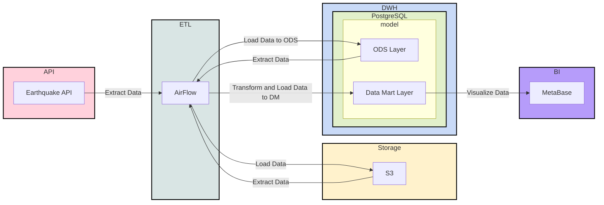

# Data Lahehouse ETL

Проект реализует полный цикл обработки данных (End-to-End Data Engineering) с использованием современного стека технологий. Пайплайн собирает данные о землетрясениях, сохраняет сырые данные в Object Storage, переносит их в DWH и строит аналитические витрины.

Цель проекта: демонстрация навыков работы с Airflow, MinIO (S3), PostgreSQL и Docker в связке с Python.

## 🛠 Технологический стек

| Категория | Технология | Описание |
| :--- | :--- | :--- |
| **Orchestration** | **Apache Airflow** (2.10.x) | Управление расписанием и зависимостями задач |
| **Storage (Raw)** | **MinIO** (S3 Compatible) | Хранение сырых JSON-файлов (Data Lake) |
| **DWH** | **PostgreSQL** | Хранилище обработанных данных и витрин |
| **BI / Viz** | **Metabase** | Визуализация данных |
| **Infra** | **Docker Compose** | Развертывание локальной инфраструктуры |
| **Language** | **Python 3.12** | Скрипты ETL и DAGs |

## 🔄 Архитектура данных

1.  **Ingest:** Извлечение данных из [USGS Earthquake API](https://earthquake.usgs.gov/fdsnws/event/1/#methods).
2.  **Raw Layer:** Сохранение JSON-ответов в MinIO (S3 bucket) для обеспечения историчности (Bronze layer).
3.  **ODS Layer:** Парсинг JSON и загрузка структурированных данных в PostgreSQL (Silver layer).
4.  **Data Marts:** SQL-трансформации для формирования бизнес-витрин (Gold layer):
    * `fct_count_day_earthquake` — количество событий по дням.
    * `fct_avg_day_earthquake` — средняя магнитуда по дням.


## 📊 Data Pipeline Architecture




## 📂 Структура репозитория

```text
.
├── dags/                           # Airflow DAGs и ETL скрипты
│   ├── raw_from_api_to_s3.py       # Extract: API -> S3
│   ├── raw_from_s3_to_pg.py        # Load: S3 -> Postgres
│   ├── fct_count_day_earthquake.py # Transform: Витрина (Counts)
│   └── fct_avg_day_earthquake.py   # Transform: Витрина (Avg Magnitude)
├── metabase/                       # Конфигурация Metabase (Dockerfile)
├── docker-compose.yaml             # Описание инфраструктуры
├── requirements.txt                # Python-зависимости
└── README.md                       # Документация проекта

```

## 🚀 Быстрый старт

### 1. Подготовка окружения

Для локальной разработки и линтинга (опционально):

```bash
python3.12 -m venv venv && \
source venv/bin/activate && \
pip install --upgrade pip && \
pip install -r requirements.txt

```

### 2. Запуск инфраструктуры

Развертывание сервисов в Docker:

```bash
docker-compose up -d

```

### 3. Доступы к сервисам

После успешного запуска (`docker ps`), сервисы доступны по следующим адресам:

| Сервис | URL | Логин (default) | Пароль (default) |
| --- | --- | --- | --- |
| **Airflow UI** | `http://localhost:8080` | `airflow` | `airflow` |
| **MinIO Console** | `http://localhost:9001` | `minioadmin` | `minioadmin` |
| **Metabase** | `http://localhost:3000` | *(настройка при входе)* | *(настройка при входе)* |
| **Postgres** | `localhost:5432` | `airflow` | `airflow` |

## ⚙️ Ручной запуск (Dev Mode)

Помимо запуска через Airflow DAGs, скрипты можно протестировать локально:

**1. Экстракция данных в S3:**

```bash
python dags/raw_from_api_to_s3.py

```

**2. Загрузка из S3 в Postgres:**

```bash
python dags/raw_from_s3_to_pg.py

```

## 🔗 Полезные ссылки

* [USGS API Documentation](https://earthquake.usgs.gov/fdsnws/event/1/#methods) — методы API.
* [USGS Data Format](https://earthquake.usgs.gov/data/comcat/index.php) — описание полей данных.
* [Apache Airflow Docs](https://airflow.apache.org/docs/) — официальная документация.

